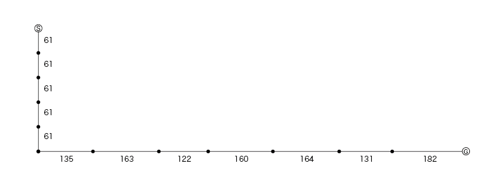

# センシングしたデータたち

## データ一覧
## 2023年4月
### 10歩+90度+5歩 ([10+90deg+5](./2023-04/10+90deg+5/))
- 4月19日 愛工大 シス研前クランク
- 使用端末: iPhone11
- 端末状態: 腰にポーチを付けてスマホを入れる
- 10歩歩いて、90度左を向いて、5歩歩く
- 歩数推定用

### 10歩+90度+5歩2 ([10+90deg+5_2](./2023-04/10+90deg+5_2/))
- 4月19日 愛工大 シス研前クランク
- 使用端末: iPhone11
- 端末状態: 腰にポーチを付けてスマホを入れる
- 10歩歩いて、90度左を向いて、5歩歩く
- 歩数推定用

### 10歩+90度+10歩 ([10+90deg+10](./2023-04/10+90deg+10/))
- 4月19日 愛工大 シス研前クランク
- 使用端末: iPhone11
- 端末状態: 腰にポーチを付けてスマホを入れる
- 10歩歩いて、90度左を向いて、10歩歩く
- 歩数推定用

### スピード変えた ([change_speed](./2023-04/change_speed/))
- 4月19日 愛工大 シス研前クランク
- 使用端末: iPhone11
- 端末状態: 腰にポーチを付けてスマホを入れる
- 10歩歩いて、90度左を向いて、5歩程度走る
- 歩数推定用

### スピード変えた2 ([change_speed_2](./2023-04/change_speed_2/))
- 4月19日 愛工大 シス研前クランク
- 使用端末: iPhone11
- 端末状態: 腰にポーチを付けてスマホを入れる
- 10歩歩いて、90度左を向いて、5歩程度走る
- 歩数推定用

### 二乗平均誤差 ([measurement_error](./2023-04/measurement_error/))
- 4月28日 愛工大 シス研前クランク
- 使用端末: iPhone11
- 端末状態: 腰にポーチを付けてスマホを入れる
- 10歩歩いて、90度左を向いて、5歩程度走る
- 二乗平均誤差用

### 階段 ([stairs](./2023-04/stairs/))
- 4月28日 愛工大 4号館別館
- 使用端末: Xperia
- 端末状態: 腰にポーチを付けてスマホを入れる
- 1階(階段前)から3階(トイレ前)へ歩く
- 3次元の移動軌跡推定用

## 2023年5月
### エレベーター ([elevator](./2023-05/elevator/))
- 5月17日 愛工大 1号館
- 使用端末: Pixel5
- 端末状態: 腰にポーチを付けてスマホを入れる
- 1号館 5階-7階にエレベーターで移動
- 動作判別用

### 階段を走る ([elevator](./2023-05/run/))
- 5月17日 愛工大 1号館
- 使用端末: Pixel5
- 端末状態: 腰にポーチを付けてスマホを入れる
- 1号館 5階-7階を走って登る
- 動作判別用

### 階段を歩く ([elevator](./2023-05/walk/))
- 5月17日 愛工大 1号館
- 使用端末: Pixel5
- 端末状態: 腰にポーチを付けてスマホを入れる
- 1号館 5階-7階を歩いて登る
- 動作判別用

### 階段を登る ([elevator](./2023-05/walk_run/))
- 5月17日 愛工大 1号館
- 使用端末: Pixel5
- 端末状態: 腰にポーチを付けてスマホを入れる
- 1号館 5階-6階を歩いて登り、6階-7階を走って登る
- 動作判別用

### 階段を登る ([elevator](./2023-05/walk_run/))
- 5月29日 家(マンション)
- 使用端末: Pixel5
- 端末状態: 腰にポーチを付けてスマホを入れる
- 徒歩 + エレベーター + 階段 + エレベーター + 徒歩
  - 玄関前からエレベーターまで歩く
  - 1階-5階 エレベーター
  - 5階-7階 階段
  - 7階-1階 エレベーター
  - エレベーターから玄関まで歩く
- 動作判別用

## 2023年6月
### 端末姿勢推定 ([terminal_coordinate](./2023-05/terminal_coordinate/))
- 5月29日 梶研
- 使用端末: Pixel5
- 端末状態: 手で持つ
- 手で持って各軸90度回転させる
  - z軸正が上(約4秒)
  - y軸正が上(約4秒)
  - x軸正が上(約4秒)
- 動作判別用

## 2023年9月
### 東京駅バス待ち無 ([tokyo-station-bus-none](./2023-09/tokyo-station-bus-none/))
- 9月2日 東京駅 JRバスターミナル
- 使用端末: Pixel6
- 端末状態: 左膝の上
- 東京駅でバス待ち中に座ってなにもしなかった

### 東京駅U字に歩く ([tokyo-station-u-walk](./2023-09/tokyo-station-u-walk/))
- 9月2日 東京駅 2階テラス
- 使用端末: Pixel6
- 端末状態: 右ポケット
- 東京駅の2階テラスでU字に歩いた
- `10歩前進` - `右向いて4歩前進` - `右向いて10歩前進`

### 東京駅バス停へいく ([tokyo-station-bus-walk](./2023-09/tokyo-station-bus-walk/))
- 9月2日 東京駅 2階テラスからJRバスターミナルへ
- 使用端末: Pixel6
- 端末状態: ポケット
- 東京駅の2階テラスからエスカレーターで降りてバス停へ歩いた

### 足助山道カーブ ([ashuke-yamamichi-curve](./2023-09/ashuke-yamamichi-curve/))
- 9月9日 足助城~三河高原キャンプ場
- 使用端末: Pixel6
- 端末状態: 座席の上
- 足助の山道を走る車内

### ブルーシートばたばた ([bluesheet-batabata](./2023-09/bluesheet-batabata/))
- 9月10日 三河高原キャンプ場
- 使用端末: Pixel6
- 端末状態: 地面
- 端末の上でブルーシートを二人で持って上下に振る
- 息を合わせた
- 気圧で遊べそう

### ブルーシートばたばたぐちゃぐちゃ ([bluesheet-batabata-guchagucha](./2023-09/bluesheet-batabata-guchagucha/))
- 9月10日 三河高原キャンプ場
- 使用端末: Pixel6
- 端末状態: 地面
- 端末の上でブルーシートを二人で持って上下に振る
- ばらばらに動いたり、小さくやめちゃ大きくなど
- 気圧で遊べそう